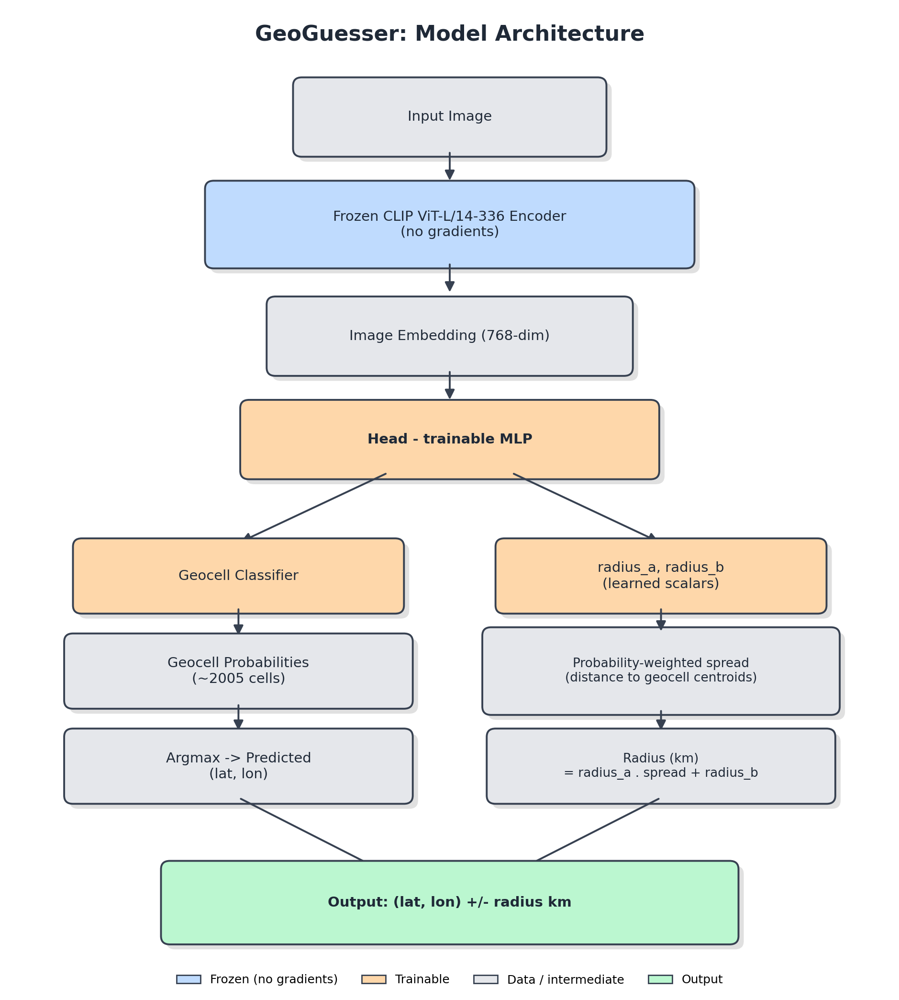

# GeoGuesser - Image Geolocation with CLIP Embeddings and Geocell Classification

Predicts where in the world a street-level or landscape photo was taken -
latitude, longitude, and a confidence radius in km using a **frozen CLIP
image encoder** and a small **trained classification head**. No reverse image
search, no mapping APIs, no external calls of any kind at inference time.

## What this is

This started as an entry to an IIT Madras AI GUILD Kaggle geolocation
hackathon, where the core constraint was: build a model that geolocates
photos end-to-end on free-tier compute (a single T4/P100 GPU), with no
internet access at inference time. This repo is a cleaned-up, single-pipeline
version of that work, built to be read and run rather than optimized purely
for leaderboard score.

The approach: take a strong pretrained vision backbone (CLIP) and freeze it
entirely - no fine-tuning the backbone itself, then train a small head on
top that classifies each image into one of ~2,000 geographic cells and
estimates its own uncertainty. Framing global geolocation as classification
into cells (rather than raw lat/lon regression) turns out to handle the
multi-modal nature of the problem much better: "this could be Portugal or it
could be coastal Brazil" is a distribution a classifier can represent
naturally, in a way that a single regressed point can't.



## Directory structure

```
GeoGuesser/
├── README.md
├── LICENSE
├── requirements.txt
├── .gitignore
├── notebook.ipynb                    # the entire pipeline, 11 sections
│
├── assets/
│   ├── architecture.png
│   └── predictions_map.png           # appears after you run Section 9
│
├── results/
│   ├── metrics.md                    # validation performance of reference/
│   └── ablations.md                  # what was tried, and what didn't work
│
├── reference/                        # our trained, validated artifacts -
│   │                                  # never modified by running the notebook
│   ├── geocell_summary.csv
│   ├── head.pt
│   ├── config.json
│   └── administrative_maps/
│       ├── ne_10m_admin_0_countries.geojson
│       ├── ne_10m_admin_1_states_provinces.geojson
│       └── ADMIN_MAP.md
│
└── data/
    └── sample/                       # small demo set, committed to git
        ├── images/
        └── images.csv
```

Everything else under `data/` (`images/`, `custom_images/`, `embeddings/`,
`checkpoints/`, `geocells/`, `splits/`, `predictions/`) is created
automatically the first time you run the notebook, and is gitignored - it's
either your own working data or regeneratable output, never something to
commit.

## Clone and run

**On Kaggle (recommended - embedding extraction and training want a GPU):**

1. New Notebook → Settings → Accelerator: **GPU T4**, Internet: **On**.
2. First cell:
   ```python
   !git clone https://github.com/Divyant-Jayakumar/GeoGuesser
   %cd GeoGuesser
   ```
3. Import `notebook.ipynb` (File → Import Notebook → Upload) and Run All.

**Locally / Colab:**
```bash
git clone https://github.com/Divyant-Jayakumar/GeoGuesser
cd GeoGuesser
pip install -r requirements.txt
jupyter notebook notebook.ipynb
```

Either way, running it top-to-bottom with no changes works immediately - it
uses the small `data/sample/` demo set and our pretrained `reference/`
checkpoint, no downloads or setup required beyond the clone.

## Three things you can do with this repo

### 1. Run our trained model on your own labeled photos (Quick Inference)

For when you have photos *and* already know where they were taken, and want
to see how well the model does on them.

- Put your images in `data/sample/images/`, and a matching
  `data/sample/images.csv` with columns `image_id, latitude, longitude`
  (`image_id` must be the exact filename, extension included).
- Run **Sections 1–3** of the notebook.
- Section 3 always reads from `reference/` - our trained checkpoint - so this
  never requires training anything yourself.
- Output: predicted vs. true coordinates and the error in km, printed per
  image and saved to `data/predictions/quick_inference_results.csv`.

### 2. Train a new head on your own dataset, then use it

For when you have a real amount of your own labeled data and want a model
trained specifically on it, rather than just evaluating ours.

- Get your data in place - either:
  - a folder of images at `data/images/` + a matching `data/images.csv`
    (`image_id, latitude, longitude`), or
  - a Kaggle-mounted dataset: in **Section 4**, set `CUSTOM_DATA_PATH` and
    `CUSTOM_LABELS_CSV` to point at `/kaggle/input/<your-dataset>/...`.
- Run **Sections 1–2**, then **4 through 10**:
  - *Section 4* loads your data and builds a train/val split.
  - *Section 5* builds geocells from your data if you have ≥10,000 labeled
    points, otherwise reuses `reference/`'s scheme.
  - *Section 6* extracts and caches CLIP embeddings for your images.
  - *Section 7* trains a fresh head on your data (100 epochs).
  - *Section 8* evaluates it on your held-out val split.
  - *Section 9* plots predictions vs. ground truth.
  - *Section 10* saves your new head to `data/checkpoints/head.pt` +
    `config.json`.
- To run inference with **your** new head instead of the reference one: in
  **Section 11**, change `CUSTOM_HEAD_PATH`, `CUSTOM_CONFIG_PATH`, and
  `CUSTOM_GEOCELLS_PATH` from `reference/...` to `data/checkpoints/head.pt`,
  `data/checkpoints/config.json`, and `data/geocells/geocell_summary.csv`.

### 3. Get predictions for photos with unknown locations

The actual real-world use case - you have photos, you genuinely don't know
where they were taken, and you want a guess.

- Drop your photos into `data/custom_images/` - no labels, no CSV needed.
- Run **Sections 1–2**, then **Section 11**.
- Output: predicted `(lat, lon) ± radius km` per photo, printed and saved to
  `data/predictions/custom_predictions.csv`.
- Uses `reference/` (our trained model) by default; point it at
  `data/checkpoints/` instead if you trained your own via option 2.

## How it works

### CLIP embeddings

Every image is passed through a **frozen** `openai/clip-vit-large-patch14-336`
image encoder - its weights are never updated, no gradients ever flow into
it. It converts each image into a 768-dimensional vector (L2-normalized) that
captures visual content: architecture style, vegetation, road markings,
signage, light quality - all the cues a person would actually use to guess a
location. Because the backbone is frozen, this is a one-time cost per image;
embeddings are cached to `.npz` so retraining the head never re-runs CLIP.

### Geocells: turning geolocation into classification

Rather than regressing latitude and longitude directly, the model classifies
each image into one of roughly 2,000 geographic cells, then reports the
winning cell's centroid as the predicted point. Cells are built from Natural
Earth boundary data:

1. Every training point is assigned to a country (admin-0) and a
   state/province (admin-1) via point-in-polygon lookup.
2. Adjacent admin-1 units within the *same* country are merged together until
   each merged cell has at least 30 points - cells never merge across country
   borders.
3. Any resulting cell with more than 150 points is split using OPTICS density
   clustering; points OPTICS can't confidently cluster are assigned to their
   nearest cluster centroid. This is a deliberately simpler stand-in for full
   Voronoi tessellation - since all that's actually needed downstream is a
   cell ID per point and a centroid per cell, not literal polygon boundaries.

The reference scheme this repo ships with has 2,005 cells.

### The Head: architecture

A small trainable network sits on top of the frozen CLIP embedding:

- **`trunk`**: a 2-layer MLP (768 → 512 → 512, ReLU + dropout between
  layers) - general-purpose feature refinement on top of the raw CLIP
  embedding.
- **`cls_head`**: a final linear layer (512 → 2,005) producing one logit per
  geocell.
- **`radius_a`, `radius_b`**: two learned scalars, used only for turning the
  model's own uncertainty into a radius (see below) - not part of the
  classification path.

### How a prediction is made

1. Image → CLIP → 768-dim embedding → `trunk` → `cls_head` → softmax over
   2,005 geocells.
2. **Predicted point** = the centroid of the highest-probability cell
   (argmax).
3. **Predicted radius**: compute the probability-weighted average distance
   from the predicted centroid to *every* geocell's centroid. A confident,
   peaked distribution (most probability on one cell and its close
   neighbors) gives a small spread; a distribution scattered across
   geographically distant cells (genuine ambiguity - "could be several
   different continents") gives a large one. That spread is passed through
   the two learned scalars: `radius_km = radius_a * spread + radius_b`. No
   further adjustment is applied - see `results/ablations.md` for why a
   post-hoc calibration step was tried and then removed.

### How the head is trained

The backbone stays frozen throughout - only `trunk`, `cls_head`, `radius_a`,
and `radius_b` ever receive gradients. Training combines four loss terms,
summed:

1. **Haversine-smoothed classification loss** - instead of a one-hot target
   (exactly one "correct" cell), nearby cells (by real-world distance) get
   partial credit. Being wrong but geographically close is penalized far
   less than being wrong and far away.
2. **Expected haversine distance** - the probability-weighted distance from
   every cell's centroid to the true point. This pushes the *whole*
   distribution toward the right region, not just whichever single cell
   happens to be the current argmax.
3. **Calibration loss** - this is what actually trains `radius_a`/`radius_b`
   into something useful: it rewards a radius that correctly covers the true
   point, and penalizes an incorrect miss more harshly the tighter the
   claimed radius was (confidently wrong is worse than honestly unsure).
4. **Soft country-match term** - rewards probability mass placed on geocells
   within the correct country, using each cell's already-known country
   (from admin-0) rather than a second geometric lookup per prediction.

Optimized with Adam over 100 epochs.

## Results

See [`results/metrics.md`](results/metrics.md) for validation performance
(median error, coverage, country accuracy) and
[`results/ablations.md`](results/ablations.md) for what was tried along the
way and didn't make the final cut - multimodal fusion, retrieval-based
prediction, a backbone comparison, and a post-hoc radius calibration step
that was ultimately removed for being hard to justify without the
competition's real scoring formula.


## Bringing your own data

The only contract this pipeline needs from a dataset: a folder of images plus
a CSV with `image_id, latitude, longitude`. Everything else - the train/val
split, geocell assignment, embeddings - is derived from that automatically.
The full dataset this repo's reference model was trained on isn't included
here (too large for git); it originates from the
[Kaggle geolocation-prediction competition](https://www.kaggle.com/competitions/geolocation-prediction).

## Tech stack

PyTorch, HuggingFace Transformers (CLIP), GeoPandas + Shapely, scikit-learn
(OPTICS), Natural Earth boundary data, Matplotlib.

